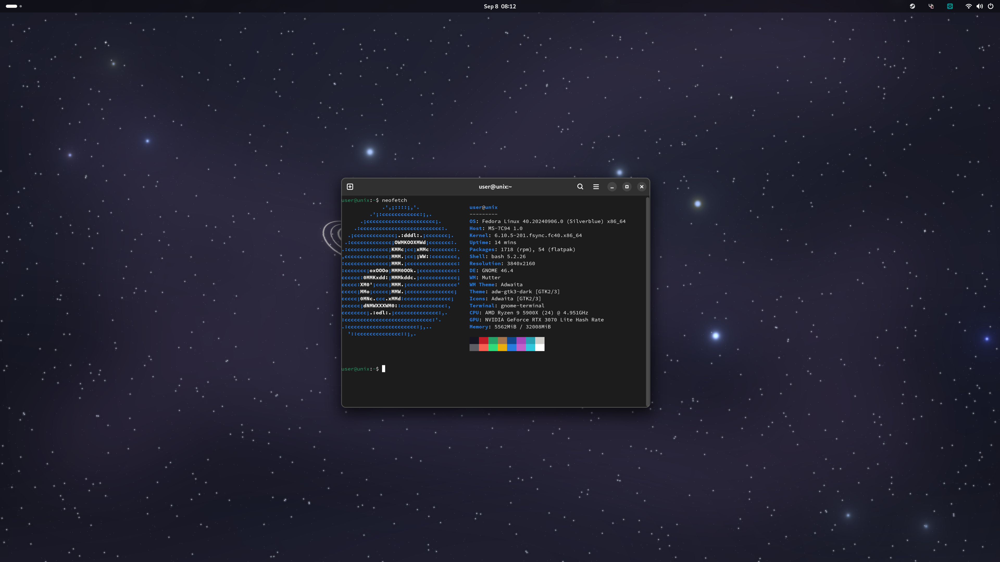

# Fedora Silverblue but different

This is just a tiny little attempt at creating a version of Fedora Silverblue that's for the most part tailored towards my own needs. It uses Universal Blue as a base, and contains some included packages, Nvidia drivers and fsync kernel.



There is no "generic" build, just ones that are highly customized for the computers I own.

- Desktop: Ryzen 9 5900x + RTX 3070
- Laptop: Lenovo Legion 5 Slim 14", Ryzen 7 7840HS + RTX 4060 Max-Q

# Installing
- First, rebase with unsigned image:
```
rpm-ostree rebase ostree-unverified-registry:ghcr.io/clc1101/personalblue-desktop:latest
# for the laptop build
rpm-ostree rebase ostree-unverified-registry:ghcr.io/clc1101/personalblue-laptop:latest
```

- Reboot:
```
systemctl reboot
```

- Then, you can rebase to the signed image:
```
rpm-ostree rebase ostree-image-signed:docker://ghcr.io/clc1101/personalblue-desktop:latest
# for the laptop build
rpm-ostree rebase ostree-image-signed:docker://ghcr.io/clc1101/personalblue-laptop:latest
```
- Reboot again:
```
systemctl reboot
```

- For secure boot support
```
ujust enroll-secure-boot-key
```

To fully utilize hardware video acceleration on Firefox, set the following settings in about:config
```
media.ffmpeg.vaapi.enabled=true
media.rdd-ffmpeg.enabled=true
gfx.x11-egl.force-enabled=true
```

> [!NOTE]
> For the laptop build, only the first setting is necessary.

Apologies in advance if this is poorly put together. I'm an artist, not a programmer.
