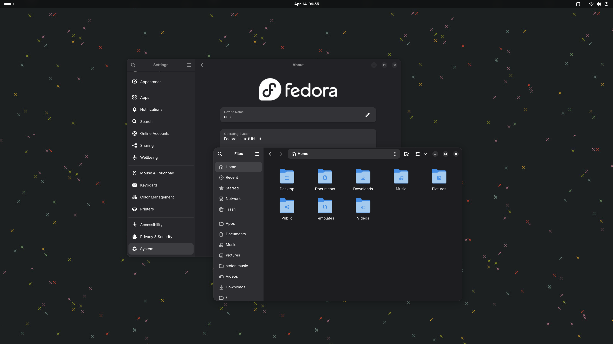

# Just Fedora Silverblue™

Just basic Fedora Silverblue, but it has tweaks that make it perfect for my use! It uses Universal Blue as a base, and contains some included packages and extensions, a slightly altered look, Nvidia drivers and the Bazzite kernel. I repeat, this was made for *me*. I wouldn't recommend anyone else use it, but you can if you really want to.



Primarily customized for my machines, but there is an untested "generic" build.

My machines in question: 
- B650, Ryzen 9 9900x + RTX 5060TI 16GB
- Lenovo Legion 5 Slim 14", Ryzen 7 7840HS + RTX 4060 Max-Q

# Installing
- First, rebase with unsigned image:
```diff
rpm-ostree rebase ostree-unverified-registry:ghcr.io/irsk0808/ublue:latest
# for desktop
rpm-ostree rebase ostree-unverified-registry:ghcr.io/irsk0808/ublue-desktop
# for laptop
rpm-ostree rebase ostree-unverified-registry:ghcr.io/irsk0808/ublue-laptop
```

- Reboot:
```
systemctl reboot
```

- Then, you can rebase to the signed image:
```diff
rpm-ostree rebase ostree-image-signed:docker://ghcr.io/irsk0808/ublue:latest
# for desktop
rpm-ostree rebase ostree-image-signed:docker://ghcr.io/irsk0808/ublue-desktop
# for laptop
rpm-ostree rebase ostree-image-signed:docker://ghcr.io/irsk0808/ublue-laptop
```
- Reboot again:
```
systemctl reboot
```

- For secure boot support
```
ujust enroll-secure-boot-key
```

To fully utilize hardware video acceleration on Firefox, set the following setting in about:config
```
media.ffmpeg.vaapi.enabled=true
```

Apologies in advance if this is poorly put together. I'm an artist, not a programmer.
